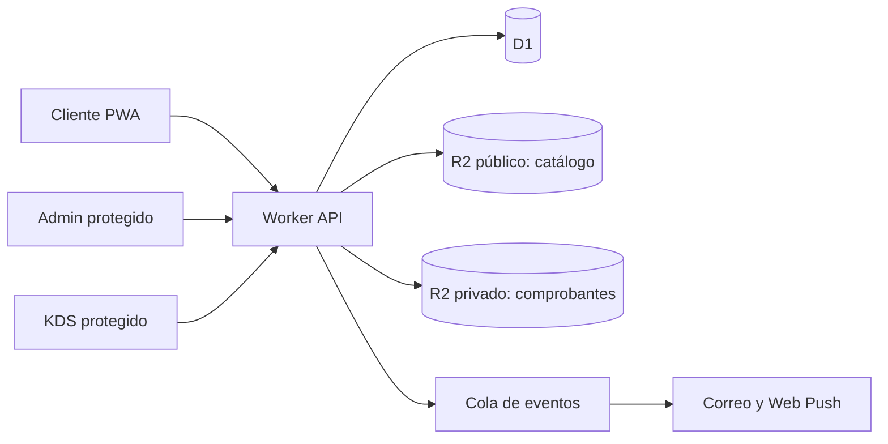

# Guía funcional y técnica — Pipiro by Solo México

**Estado:** documento vigente para revisión

**Fecha:** 18 de agosto de 2026

**Piloto inicial:** Escuela Internacional Sampedrana (EIS)

**Moneda:** lempira hondureño (HNL)
**Zona horaria:** `America/Tegucigalpa`

## 1. Objetivo de esta etapa

Convertir la demostración visual actual en una plataforma piloto real para que familias y maestros puedan:

- iniciar sesión de forma segura;
- administrar su perfil y los perfiles de sus hijos;
- consultar el menú permitido para cada fecha y horario;
- crear, modificar y cancelar pedidos conforme a las reglas vigentes;
- pagar inicialmente por transferencia bancaria;
- recibir avisos en la aplicación, por correo y, cuando el dispositivo lo permita, mediante notificaciones push;
- conocer el estado de preparación y entrega.

Al mismo tiempo, Solo México debe poder administrar menús y calendarios, verificar transferencias, procesar comandas en cocina, imprimir etiquetas y registrar la entrega.

La demostración actual es una buena base de interfaz, pero todavía usa datos locales de ejemplo. No debe recibir datos reales de menores ni pedidos reales hasta terminar autenticación, autorización, persistencia y respaldos.

## 2. Decisión recomendada de arquitectura

Pipiro debe convertirse en tres aplicaciones separadas, aunque compartan componentes y una misma API:

| Aplicación | Dominio propuesto | Usuarios | Protección principal |
|---|---|---|---|
| Cliente PWA | `pipiro.solomexicohn.com` | Familias y maestros | Google, correo con código y passkey |
| Administración/CMS | `gestion-pipiro.solomexicohn.com` | Dos administradores y futuros supervisores | Cloudflare Access + rol interno |
| Cocina/KDS y despacho | `kds-pipiro.solomexicohn.com` | Cocina, entrega y motorista | Dispositivo autorizado + cuenta individual/PIN |

La API y la base de datos permanecerán del lado del servidor. El navegador nunca recibirá llaves de D1, R2, correo, cifrado ni futuros proveedores de pago.



Que Admin y Cocina tengan dominios diferentes evita incluir sus pantallas y código en la aplicación del cliente. Sin embargo, ocultar el nombre del dominio no es seguridad: los hostnames pueden descubrirse mediante DNS o registros de certificados. La protección real debe ser autenticación, autorización por rol en cada endpoint, política de acceso por defecto denegado, límites de intentos y auditoría.

## 3. Google Workspace: qué resuelve y qué no

### Recomendación

Si el costo mensual es aceptable, Google Workspace es la opción más ordenada para la operación interna de Pipiro porque reúne:

- correos con el dominio `solomexicohn.com`;
- cuentas individuales para administradores;
- grupos como `administradores@solomexicohn.com`;
- Drive y documentos operativos;
- recuperación de cuentas y baja centralizada de personal;
- integración del grupo de administradores con Cloudflare Access.

Esto mejora la gestión interna, pero no es necesario para ofrecer el botón **Continuar con Google** a los clientes. El login público se configura en un proyecto de Google Cloud OAuth y debe aceptar cuentas externas; si se configura como “interno” de Workspace, las familias con Gmail u otros dominios no podrán entrar.

### Correo recomendado

- `pedidos@solomexicohn.com`: bandeja compartida o Google Group para atención y conciliación.
- `soporte@solomexicohn.com`: soporte al cliente.
- cuentas nominales para cada administrador; no compartir contraseñas.
- un servicio transaccional separado para códigos de acceso, confirmaciones y alertas automáticas.

Un alias sencillo entrega el correo a una sola persona. Para que varias personas gestionen `pedidos@`, conviene una bandeja colaborativa o delegada. El dominio debe tener un solo proveedor principal de correo y sus registros MX; no conviene mezclar Google Workspace y Zoho como receptores principales sin diseñar una entrega dividida.

### Alternativa de menor costo

Zoho Mail puede manejar las bandejas humanas y ZeptoMail los correos transaccionales. Esta alternativa no impide usar Google OAuth para clientes. La decisión entre Workspace y Zoho debe tomarse antes de configurar DNS y el remitente definitivo, pero no bloquea el desarrollo de perfiles, catálogo, pedidos, cocina o pagos por transferencia.

### Decisión pendiente

Antes de activar correos reales hay que elegir:

1. Google Workspace o Zoho como correo principal del dominio.
2. Servicio transaccional: Cloudflare Email Service si está disponible y se ajusta al piloto, o ZeptoMail/otro proveedor dedicado.
3. Quiénes recibirán y responderán `pedidos@` y `soporte@`.

## 4. Inicio de sesión y cuentas

### Familias y maestros

Se recomienda Better Auth alojado en el Worker con D1:

- alta e inicio con Google;
- alta e inicio por correo mediante código de un solo uso;
- passkey opcional después de verificar la primera sesión;
- sin contraseña tradicional durante el piloto;
- sesiones revocables en cookie `HttpOnly`, `Secure` y `SameSite`;
- Turnstile y límites de frecuencia en solicitud/verificación de códigos.

Los passkeys no tienen costo por autenticación, pero dependen del dominio. Deben configurarse directamente para `pipiro.solomexicohn.com` y probarse allí; cambiar después el dominio principal puede obligar a registrar passkeys nuevamente.

Cada persona tendrá una sola cuenta de cliente. Un maestro que compra para sí mismo o para sus hijos usa el mismo recorrido que cualquier cliente. Ser maestro no concede permisos administrativos.

### Administradores

- acceso previo mediante Cloudflare Access;
- identidad individual, idealmente de Google Workspace;
- rol de aplicación comprobado también por la API;
- passkey o MFA obligatorio;
- inicialmente los administradores autorizados son `daniel@wembla.com` y `dachavarriam@gmail.com`, hasta migrarlos o agregar cuentas del dominio;
- toda publicación, cambio de precio, conciliación de pago y cancelación debe quedar en auditoría.

### Cocina y entrega

Como el personal no tendrá correo, el piloto puede usar:

- cuenta creada por un administrador;
- nombre corto o identificador y PIN de seis dígitos;
- PIN almacenado únicamente como hash resistente;
- bloqueo temporal y alerta después de varios intentos fallidos;
- sesión corta y cierre al terminar turno;
- tablet o computadora previamente autorizada para el KDS;
- permisos separados para cocina, empaque, entrega y supervisor.

No se debe usar un único PIN compartido. Cada acción debe identificar a la persona que la realizó. Cloudflare Access puede proteger además el dispositivo o la red, pero no sustituye el usuario individual dentro de Pipiro.

## 5. Recorrido completo del cliente

### Primera entrada

1. Abrir `pipiro.solomexicohn.com`.
2. Ingresar con Google o código enviado por correo.
3. Aceptar términos, aviso de privacidad y política de tratamiento de datos de menores.
4. Completar nombre, teléfono opcional y preferencia de idioma.
5. Crear al menos un destinatario: hijo, dependiente o el propio usuario.
6. Confirmar expresamente que la información de alergias fue revisada, incluso cuando la respuesta sea “ninguna conocida”.

### Perfil y destinatarios

La página **Mi perfil** debe permitir:

- editar nombre, idioma y canales de notificación;
- administrar métodos de acceso y passkeys;
- consultar sesiones activas y cerrar otras sesiones;
- solicitar exportación o eliminación de datos;
- ver pedidos, créditos y comprobantes.

Cada perfil de estudiante debe incluir:

- nombre y apellido;
- relación con la cuenta;
- grado, sección, maestra guía, aula y edificio;
- horario o punto de entrega;
- alergias e indicaciones críticas;
- estado activo/inactivo;
- fecha de última confirmación de alergias.

EIS permanecerá fija y no se mostrará un selector de escuela. La estructura inicial será Nursery, Prekínder, Kínder y primero a undécimo grado, con secciones A–E. Admin podrá mantener maestros, aulas, edificios y puntos de entrega sin modificar código.

Los datos del estudiante se reutilizan al comprar. El cliente puede modificar una instrucción para un pedido particular, pero la aplicación debe distinguir claramente entre “solo este pedido” y “actualizar el perfil”.

### Crear un pedido

1. Elegir destinatario.
2. Elegir una fecha disponible para almuerzo; nunca se ofrece el mismo día.
3. Mostrar únicamente los productos publicados y con capacidad para esa combinación.
4. Abrir la ficha del platillo y exigir todas las opciones obligatorias.
5. Mostrar alergias del perfil y pedir confirmación antes de agregar al carrito.
6. Permitir agregar, quitar y cambiar cantidades antes del cierre.
7. Revalidar precio, disponibilidad, capacidad y hora límite en el servidor al confirmar.
8. Crear una orden con referencia única y mostrar las instrucciones de transferencia.

La primera versión tendrá los ocho platillos permanentes configurables, bebidas separadas y una categoría de especialidades que Admin podrá publicar según el calendario.

### Modificar o cancelar

- antes de la hora límite: el cliente puede modificar o cancelar conforme a la política publicada;
- después de la hora límite: el pedido se bloquea automáticamente;
- una excepción administrativa requiere motivo y queda auditada;
- si un pedido ya fue procesado, la cancelación se cobra o se convierte en crédito según la política definida;
- los importes y contenidos originales nunca se sobrescriben: se conserva un historial de cambios.

## 6. Ventanas de pedido, calendario y capacidad

Toda regla de tiempo debe calcularse en el servidor con `America/Tegucigalpa`, no con el reloj del teléfono.

Regla inicial confirmada para el piloto:

| Servicio | Entrega | Cierre para pedir |
|---|---:|---:|
| Almuerzo | 11:30 a. m. | 11:59 p. m. del día anterior |

Pipiro no ofrecerá desayunos en esta etapa. Un pedido siempre requiere al menos un día calendario de anticipación; por ejemplo, el lunes se puede pedir para el martes hasta las 11:59 p. m., pero no para el mismo lunes.

Admin debe poder configurar:

- horarios normales por servicio;
- excepciones por fecha;
- días feriados o sin clases;
- apertura o cierre manual con motivo;
- fechas máximas de compra anticipada;
- capacidad total por servicio y por platillo;
- menú publicado, borrador o archivado;
- precio y disponibilidad vigentes;
- mensajes visibles, por ejemplo “Pedidos cerrados” o “No hay clases”.

El calendario debe permitir clonar una semana, editar días individuales y previsualizar exactamente lo que verá el cliente antes de publicar.

Cada pedido conserva una copia inmutable del nombre, precio, opciones, alergias confirmadas y ubicación de entrega usados al comprar. Cambiar un platillo o perfil después no altera silenciosamente una comanda existente.

## 7. Administración y CMS

El portal de gestión debe incluir estos módulos:

### Catálogo

- categorías, platillos, bebidas y especialidades;
- nombre y descripción en español e inglés;
- precio HNL guardado como centavos enteros;
- fotografía, estado, SKU y orden de presentación;
- grupos de opciones obligatorias u opcionales;
- ingredientes y alérgenos declarados;
- disponibilidad y límites de producción.

Las imágenes públicas del catálogo pueden permanecer en el bucket R2 `solomexico` y publicarse mediante `media.solomexicohn.com`. Comprobantes, datos de estudiantes, exportaciones y respaldos deben ir a buckets privados distintos, nunca al dominio público de medios.

### Importación masiva

Se necesita un flujo seguro de cinco pasos:

1. Subir CSV/XLSX e imágenes.
2. Validar columnas, SKU, opciones, precios y archivos.
3. Mostrar errores y una vista previa sin publicar.
4. Confirmar explícitamente la importación.
5. Publicar una versión con auditoría y posibilidad de revertir.

Los nombres de archivo no deben ser la llave de relación; se utilizará un SKU estable. Las imágenes deben limitar tamaño y tipo y eliminar metadatos innecesarios.

### Operación

- calendario y ventanas de venta;
- pedidos y búsqueda por referencia, destinatario o fecha;
- cola de transferencias por verificar;
- cancelaciones, créditos e incidencias;
- usuarios, roles y dispositivos autorizados;
- aulas, maestros, ubicaciones y rutas de entrega;
- reportes de ventas, producción, puntualidad y desperdicio;
- historial de auditoría exportable.

## 8. Pago por transferencia para el piloto

El flujo propuesto es:

1. Pipiro crea la orden como `pendiente_de_pago` y reserva capacidad por un tiempo limitado.
2. Muestra banco, beneficiario, cuenta, monto exacto HNL, referencia Pipiro y vencimiento.
3. El cliente puede ingresar el número de operación generado por el banco y sube una imagen del comprobante.
4. El comprobante se guarda en R2 privado y solo se entrega mediante un endpoint administrativo autorizado, nunca desde el dominio público de medios.
5. Admin revisa una cola y marca `aprobado`, `rechazado` o `duplicado`.
6. Solo una orden aprobada pasa a producción, salvo una regla explícita de crédito autorizado.
7. Una orden no pagada vence automáticamente y libera capacidad.
8. El cliente recibe correo, aviso interno y push sobre el resultado.

Falta definir antes de usarlo:

- banco, titular y números de cuenta;
- plazo máximo para transferir y para que Admin verifique;
- evidencia aceptada;
- manejo de depósitos por monto incorrecto o referencia repetida;
- política de cancelación, devolución y saldo a favor;
- responsables y horario de conciliación.

El estado del pago debe ser independiente del estado del pedido. Por ejemplo, una orden puede estar `pagada` y a la vez `en_preparacion`.

Cuando se agreguen tarjetas se utilizará un checkout alojado o campos tokenizados del proveedor. Pipiro no almacenará número completo de tarjeta ni CVV. La integración futura tendrá endpoints y webhooks idempotentes, pero se deja para después de validar la operación real.

La interfaz puede mostrar desde ahora **Tarjeta de crédito o débito — Próximamente**, pero no debe crear una orden pagada ni enviar una comanda a cocina hasta recibir una confirmación auténtica del proveedor. Cuando se habilite, un webhook verificado marcará el pago como aprobado y la orden pasará directamente a Cocina sin conciliación manual.

## 9. Cocina, etiquetas y entrega

### KDS

La pantalla de cocina debe mostrar órdenes pagadas/autorizadas por fecha y servicio, con alertas visuales y sonoras. Estados mínimos:

`nueva` → `aceptada` → `en_preparacion` → `lista` → `empacada` → `despachada` → `entregada`

También debe permitir `incidencia` y `cancelada`, con motivo y autorización correspondiente.

Para el piloto puede refrescar de manera confiable cada pocos segundos. Cuando el volumen lo justifique se puede añadir actualización en tiempo real con Durable Objects/WebSockets; la base de datos sigue siendo la fuente oficial.

La cocina necesita vistas agrupadas por:

- platillo y opción para preparación;
- almuerzo, fecha y hora;
- grado, sección, aula, edificio o ruta;
- alergia o instrucción crítica;
- estado y retraso.

### Etiquetas

Cada paquete debe imprimir como mínimo:

- referencia y código/QR de entrega;
- nombre del destinatario;
- grado, sección, aula y maestra guía;
- servicio y hora;
- platillo y opciones;
- alerta de alergia visible sin exponer más información de la necesaria;
- número de paquete, por ejemplo 1 de 2.

Para la futura impresora conviene buscar una térmica de 80 mm compatible con ESC/POS, USB y Ethernet; Ethernet es preferible para una estación fija. Antes de comprar se debe confirmar compatibilidad con el sistema operativo del equipo de cocina, controlador disponible, cortador automático, resolución mínima de 203 dpi y disponibilidad local de papel/etiquetas. El navegador normalmente no imprime de forma silenciosa: el piloto puede usar diálogo de impresión y luego incorporar un puente local autorizado si se necesita impresión automática.

### Entrega

El módulo de despacho debe crear manifiestos por ubicación/ruta, permitir escanear el código del paquete y confirmar entrega. Una entrega manual debe exigir destinatario, responsable y motivo. No se debe marcar entregado únicamente porque cocina terminó de preparar.

## 10. Notificaciones

Pipiro tendrá tres canales:

- centro de notificaciones dentro de la PWA;
- correo transaccional;
- Web Push cuando el usuario lo autorice.

En iPhone y iPad, Web Push funciona para una PWA agregada a la pantalla de inicio y el permiso debe pedirse como resultado de una acción del usuario. Siempre debe existir correo e historial interno como alternativa.

Eventos recomendados:

- orden creada y transferencia pendiente;
- transferencia aprobada o rechazada;
- recordatorio antes del cierre;
- orden aceptada por cocina;
- pedido listo o despachado;
- entrega confirmada;
- incidencia o cancelación;
- cambio importante de calendario.

Los eventos se enviarán a una cola para reintentos y deduplicación. Una falla de correo o push no debe deshacer una orden. Las notificaciones de pantalla bloqueada y los asuntos de correo no deben revelar alergias ni datos innecesarios del menor.

## 11. Modelo de datos mínimo

Entidades principales:

- usuarios, identidades externas, sesiones y passkeys;
- roles, permisos, personal y dispositivos;
- perfiles de cliente y destinatarios;
- escuelas, grados, secciones, maestros, aulas y puntos de entrega;
- categorías, productos, opciones, alérgenos e imágenes;
- servicios, calendarios, menús publicados, cierres y capacidades;
- carritos, órdenes, líneas, instantáneas y eventos;
- pagos, transferencias, comprobantes, conciliaciones y créditos;
- tickets de cocina, paquetes, etiquetas, despachos y entregas;
- suscripciones push, preferencias y entregas de notificaciones;
- consentimientos, auditorías e incidencias.

Reglas críticas:

- todas las consultas de cliente verifican propiedad del perfil y la orden;
- todos los endpoints internos comprueban permiso en el servidor;
- las órdenes usan llaves de idempotencia para evitar duplicados;
- creación de orden y reserva de capacidad ocurren de forma transaccional;
- dinero se guarda como entero, nunca como coma flotante;
- los eventos importantes son anexados, no borrados ni reescritos.

## 12. Seguridad, privacidad y respaldos

### Controles obligatorios antes de datos reales

- TLS, HSTS y política CSP restrictiva;
- cookies seguras, protección CSRF y comprobación de origen;
- consultas preparadas y validación de entradas en el servidor;
- Turnstile, rate limiting y bloqueo progresivo en OTP y PIN;
- permisos mínimos para bindings, cuentas y personal;
- separación total entre desarrollo, pruebas y producción;
- secretos únicamente en el almacén de secretos de Workers;
- logs sin nombres de menores, alergias, códigos OTP ni comprobantes;
- archivos privados con acceso temporal y validación de tipo/tamaño;
- bitácora de accesos y cambios administrativos;
- plan de respuesta a incidentes y revocación de sesiones.

D1 cifra datos en reposo y en tránsito. Aun así, los campos particularmente sensibles de perfiles y alergias pueden cifrarse además a nivel de aplicación con una llave fuera de D1 y rotación versionada. El cifrado no sustituye la autorización: cada consulta debe seguir verificando quién puede leer el dato.

### Privacidad de menores

Antes del piloto real se necesita:

- aviso de privacidad y términos revisados para Honduras;
- consentimiento verificable del responsable;
- propósito y tiempo de retención para cada dato;
- mecanismo de corrección, exportación y eliminación;
- acceso limitado a cocina y entrega solo a lo indispensable;
- procedimiento para incidentes de alergias y datos incorrectos;
- revisión jurídica local antes de aceptar información real de estudiantes.

### Respaldos

D1 Time Travel ofrece recuperación puntual dentro de su ventana disponible. Además se deben realizar exportaciones programadas cifradas a un bucket R2 privado, mantener una política de retención y probar restauraciones. El bucket público `solomexico` no es lugar para respaldos.

## 13. Estructura técnica propuesta

La evolución recomendada del repositorio con pnpm es:

```text
apps/
  customer/        PWA pública
  admin/           CMS y operaciones
  kds/             cocina, empaque y despacho
workers/
  api/             autenticación, reglas y acceso a datos
packages/
  ui/              componentes compartidos
  domain/          tipos, validaciones y reglas comunes
```

Cada aplicación tendrá su propio bundle y despliegue. Compartir componentes no significa compartir permisos ni pantallas. Los navegadores se comunican con endpoints autorizados; D1 y R2 nunca se exponen directamente.

## 14. Plan de implementación y demostraciones

Cada etapa debe terminar con una demostración navegable y pruebas de aceptación antes de pasar a la siguiente.

### Fase 0 — Decisiones y cuentas

- decidir Google Workspace o Zoho;
- crear cuentas nominales y grupos;
- confirmar cuentas bancarias y política de transferencia;
- confirmar horarios, ventanas y política de cancelación;
- definir responsable de Admin, cocina, despacho y soporte.

**Demostración:** documento de configuración aprobado, sin datos reales.

### Fase 1 — Núcleo funcional con identidad de demostración

- separar Cliente, Admin y KDS en aplicaciones;
- definir una capa de identidad reemplazable con usuarios ficticios;
- aplicar propiedad y roles simulados en todos los datos y endpoints;
- mantener bloqueado el uso de datos personales reales;
- crear ambientes de desarrollo, pruebas y producción.

**Demostración:** todos los recorridos operan con identidades ficticias y ninguna tabla depende de un usuario global o anónimo.

### Fase 2 — Perfiles y destinatarios

- perfil de cuenta y seguridad;
- alta, edición y baja lógica de hijos/destinatarios;
- grados, secciones, maestros, aulas y ubicaciones administrables;
- alergias, confirmación obligatoria y consentimiento.

**Demostración:** dos cuentas no pueden ver ni modificar los perfiles de la otra.

### Fase 3 — CMS, catálogo y calendario

- CRUD real de productos, opciones, precios e imágenes;
- importación masiva con vista previa;
- calendario, cierres, capacidad y publicación versionada;
- ocho productos permanentes, bebidas y especialidades.

**Demostración:** Admin publica un menú y el cliente ve exactamente la versión permitida.

### Fase 4 — Carrito y pedidos reales

- carrito persistente;
- validaciones de opción, alergia, capacidad y corte;
- orden transaccional e idempotente;
- modificación, cancelación, historial y créditos preparados.

**Demostración:** pedidos antes y después del cierre, intento duplicado y agotamiento de capacidad.

### Fase 5 — Transferencias

- instrucciones y referencia única;
- comprobantes privados;
- cola de conciliación;
- vencimiento y liberación de capacidad;
- créditos y auditoría.

**Demostración:** transferencia aprobada, rechazada, duplicada y orden vencida.

### Fase 6 — KDS, etiquetas y entrega

- comanda agrupada y estados;
- alertas y tiempos;
- impresión de etiquetas;
- manifiestos, escaneo y confirmación de entrega;
- incidencias.

**Demostración:** una orden completa desde cliente hasta entrega, con trazabilidad de cada usuario.

### Fase 7 — Notificaciones

- centro interno;
- correos transaccionales;
- Web Push y preferencias;
- cola, reintentos, deduplicación y monitoreo.

**Demostración:** fallar deliberadamente un canal sin perder la orden ni bloquear los demás.

### Fase 8 — Login y autorización para el piloto

- activar Google, correo OTP y passkeys para clientes;
- reemplazar el actor demo por la identidad de la sesión;
- proteger Admin con Cloudflare Access y roles de aplicación;
- implementar cuentas individuales/PIN y dispositivo autorizado para KDS;
- probar acceso indebido entre clientes, roles y aplicaciones;
- revocación de sesiones, límites de intentos y recuperación.

**Demostración:** cada usuario solo ve sus datos y un cliente no puede llamar endpoints internos.

El login puede implementarse en esta etapa porque las funcionalidades anteriores utilizan desde el inicio identificadores de usuario y comprobaciones de propiedad. No se permite publicar el piloto real ni cargar datos de menores antes de completar esta fase.

### Fase 9 — Piloto controlado

- pruebas de autorización y seguridad;
- revisión de privacidad;
- respaldos y restauración probada;
- observabilidad, alertas y manual de contingencia;
- prueba con usuarios invitados y datos controlados;
- capacitación de Admin, cocina y entrega.

**Demostración:** jornada simulada completa, incluyendo internet intermitente, pedido tardío e incidencia.

### Fase 10 — Tarjetas

- seleccionar adquirente/proveedor disponible en Honduras;
- checkout tokenizado y webhooks;
- conciliación, reembolso, contracargos y reportes;
- revisión de alcance PCI.

## 15. Publicación de demos en vivo

Se puede crear `pipiro.solomexicohn.com` desde la Fase 1 para pruebas rápidas, con estas condiciones:

- acceso por invitación o lista de usuarios durante el piloto;
- solamente datos ficticios hasta aprobar autenticación, privacidad y respaldos;
- Admin y KDS desplegados aparte y protegidos;
- ambientes y bases de datos de prueba separados de producción;
- despliegue después de revisión local y aprobación explícita;
- nunca ejecutar automáticamente migraciones remotas o publicar solo por terminar un cambio.

El flujo de trabajo recomendado es: cambio local → revisión y demostración local → aprobación → commit/push → despliegue de prueba → verificación → promoción al piloto.

## 16. Información que todavía necesitamos

No todo bloquea el desarrollo al mismo tiempo, pero estas decisiones deben quedar resueltas antes de su fase correspondiente:

- proveedor de correo principal: Workspace o Zoho;
- correos nominales de administradores y responsables de soporte;
- cuenta bancaria y texto exacto de transferencia;
- política escrita de vencimiento, cancelación, crédito y devolución;
- días operativos y confirmación definitiva de la hora de entrega del almuerzo;
- capacidad diaria y por producto;
- catálogo final, bebidas, precios, fotografías, ingredientes y alérgenos;
- calendario escolar, feriados y ubicaciones reales de EIS;
- catálogo de maestros, aulas, edificios y rutas de entrega;
- personal de cocina/entrega, roles y dispositivo que usará el KDS;
- impresora elegida y tamaño real de etiqueta;
- datos legales de Solo México, aviso de privacidad, términos y contacto de soporte;
- responsables de conciliación, preparación, entrega e incidentes.

## 17. Criterio para considerar el piloto listo

Pipiro estará listo para pedidos reales cuando, como mínimo:

- las tres aplicaciones estén separadas y protegidas;
- cada acceso y acción tenga identidad y permiso verificable;
- perfiles y alergias estén protegidos y cuenten con consentimiento;
- Admin publique menú, precio, calendario y capacidad sin tocar código;
- el servidor haga cumplir cierres y evite pedidos duplicados;
- transferencias se concilien con evidencia privada y auditoría;
- cocina reciba, procese, etiquete y despache sin perder comandas;
- el cliente reciba confirmaciones y pueda consultar su historial;
- exista respaldo probado, monitoreo y procedimiento de contingencia;
- una jornada completa de prueba termine sin exposición de datos ni pedidos huérfanos.

## 18. Referencias técnicas

- [Cloudflare D1: seguridad de datos](https://developers.cloudflare.com/d1/reference/data-security/)
- [Cloudflare D1: Time Travel](https://developers.cloudflare.com/d1/reference/time-travel/)
- [Cloudflare R2](https://developers.cloudflare.com/r2/how-r2-works/)
- [Cloudflare Access con Google Workspace](https://developers.cloudflare.com/cloudflare-one/integrations/identity-providers/google-workspace/)
- [Cloudflare Access: tipos de aplicaciones](https://developers.cloudflare.com/cloudflare-one/access-controls/applications/choose-application-type/)
- [Cloudflare Turnstile: validación en servidor](https://developers.cloudflare.com/turnstile/get-started/server-side-validation/)
- [Better Auth: Google](https://better-auth.com/docs/authentication/google)
- [Better Auth: códigos por correo](https://better-auth.com/docs/plugins/email-otp)
- [Better Auth: passkeys](https://better-auth.com/docs/plugins/passkey)
- [Google Workspace: registros MX](https://support.google.com/a/answer/6156494)
- [Google Workspace: alias de correo](https://support.google.com/a/answer/33327)
- [Google Groups: bandeja colaborativa](https://support.google.com/a/users/answer/10375787)
- [Web Push en iOS y iPadOS](https://webkit.org/blog/13878/web-push-for-web-apps-on-ios-and-ipados/)
- [PCI SSC: almacenamiento de CVV](https://www.pcisecuritystandards.org/faqs/1280/)
# Actualización: checkout familiar y transferencias

- Un carrito puede incluir platillos para varios perfiles de estudiantes. Cada producto queda asignado al estudiante activo.
- Al confirmar, Pipiro crea una orden separada por estudiante para cocina, empaque, etiqueta y entrega, pero genera un solo checkout, total y comprobante bancario.
- Banco inicial: BAC Credomatic; titular: CHM SA. Número y tipo de cuenta se editan desde Administración.
- El comprobante vence a las 11:59 p. m. del día anterior a la entrega. Sin comprobante, el pago y las órdenes pendientes expiran.
- La cancelación por el cliente cierra a las 8:00 p. m. del día anterior. Si ya estaba pagado, Administración recibe una tarea para conceder el crédito; el saldo no se crea silenciosamente.
- Administración puede crear créditos con monto y motivo. El cliente puede aplicarlos total o parcialmente antes de transferir.
- Si el monto recibido no coincide, el cliente recibe una alerta para elegir reembolso o transferencia de la diferencia.
- Ayuda permite enviar comentarios, quejas, solicitudes y casos de pago, opcionalmente vinculados a una orden.
- Los comprobantes permanecen en un binding R2 privado. El bucket público `solomexico` se reserva para recursos públicos del catálogo: un prefijo no es una barrera de seguridad.

## Acceso con Google

- Client ID configurado como variable no secreta `GOOGLE_CLIENT_ID`.
- Inicio: `/api/auth/google/start`.
- Callback exacto: `https://pipiro.solomexicohn.com/api/auth/google/callback`.
- El flujo usa Authorization Code, PKCE, `state` y `nonce` de un solo uso.
- El Worker verifica firma, emisor, audiencia, vencimiento, correo verificado y `nonce` del ID token.
- La sesión se guarda como token aleatorio; D1 conserva únicamente su hash.
- La cookie de producción es `HttpOnly`, `Secure`, `SameSite=Lax` y no tiene acceso desde JavaScript.
- `GOOGLE_CLIENT_SECRET` nunca se coloca en `wrangler.jsonc`, React o Git. Se instala con `wrangler secret put`.
- La demo continúa abierta hasta que los endpoints de pedidos cambien del actor demo a la sesión autenticada.
