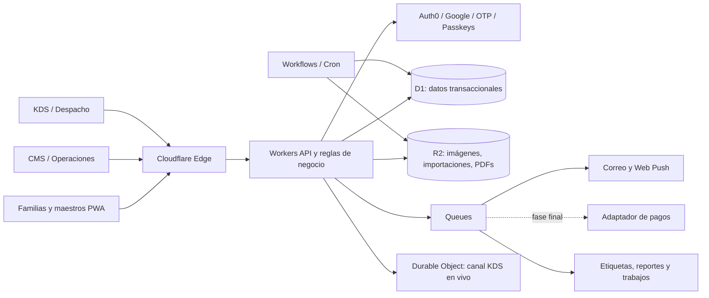

# Plan maestro — Lonchera Solo México

**Estado:** propuesta para revisión  
**Fecha:** 9 de agosto de 2026  
**Mercado inicial:** Honduras  
**Idioma predeterminado:** español de Honduras (`es-HN`)  
**Idioma alterno:** inglés de Estados Unidos (`en-US`)  
**Moneda:** lempira hondureño (`HNL`), guardado siempre como centavos enteros

## 1. Recomendación ejecutiva

Construir una plataforma de pedidos escolares con tres experiencias conectadas:

1. **PWA de familias y maestros:** descubrir el menú, elegir al alumno, programar desayuno o almuerzo, pagar, seguir el pedido y recibir confirmación de entrega.
2. **Portal de operaciones/CMS:** administrar escuelas, aulas, horarios, alumnos vinculados, menús, precios, capacidad, calendarios, importaciones masivas, órdenes, usuarios, reportes y soporte.
3. **KDS de cocina y entrega:** recibir pedidos en tiempo real, agrupar producción, imprimir etiquetas, empacar, despachar por escuela/aula y confirmar la entrega.

La recomendación para el MVP es **Cloudflare Workers + D1 + R2 + Queues**, sin una base de datos self-hosted. Es la alternativa más eficiente al inicio porque reduce servidores, parches, redes privadas y respaldos manuales. La capa de acceso a datos se mantendrá aislada para poder migrar a PostgreSQL administrado si el volumen o la complejidad futura lo justifican.

Para identidad se recomienda **Auth0 Universal Login** como primera opción: Google, correo con código de un solo uso y passkeys, sin que la aplicación almacene contraseñas. Los administradores, cocina, despacho y finanzas deben usar passkey o MFA obligatorio.

El **cobro con tarjeta queda fuera del MVP y se implementará al final**, después de comprobar que el flujo escolar funciona. La primera versión creará y administrará pedidos sin procesar dinero dentro de la aplicación. Solamente se reservarán estados y una interfaz técnica para agregar un proveedor en el futuro, sin construir checkout, tokenización ni webhooks todavía.

## 2. Alcance del producto

### Objetivo principal

Permitir que un padre, encargado o maestro programe comida para un alumno específico y que el restaurante pueda producirla, identificarla, transportarla y entregarla en la ubicación y horario correctos, con trazabilidad completa.

### Principios de diseño

- El pedido comienza con el **alumno y la fecha de entrega**, no solamente con el platillo.
- Una orden confirmada conserva una copia inmutable del nombre, precio, impuestos y opciones compradas.
- Pedido, preparación y entrega son estados separados; cuando se agregue pago, también tendrá su propio estado.
- Toda transición sensible queda en una bitácora auditable.
- La interfaz muestra datos mínimos del menor según el rol y la tarea.
- El navegador nunca recibe secretos de infraestructura, claves privadas ni credenciales de pago.
- La confirmación final de compra requiere conexión; no se prometerán pedidos offline que el servidor no haya aceptado.
- La experiencia debe sentirse familiar como una app de delivery, pero optimizada para calendario escolar, producción por lotes y entrega por aula.

### Fuera del MVP

- Marketplace abierto con muchos restaurantes y liquidaciones automáticas a terceros.
- Aplicaciones nativas separadas para iOS y Android.
- Rastreo GPS de repartidores en tiempo real.
- Monedero, puntos, referidos y promociones complejas.
- Optimización automática de rutas con mapas.
- Facturación fiscal automatizada hasta definir reglas contables y tributarias.

## 3. Experiencias y dominios propuestos

| Superficie | Dominio sugerido | Usuario | Propósito |
|---|---|---|---|
| PWA de pedidos | `lonchera.solomexicohn.com` | Padres, encargados y maestros | Comprar y seguir pedidos |
| Operaciones/CMS | `admin-lonchera.solomexicohn.com` | Administradores, soporte y finanzas | Configuración, contenido y control |
| KDS y despacho | `cocina.solomexicohn.com` | Cocina, empaque y repartidores | Producción y entrega |
| API | Preferiblemente mismo origen mediante `/api`; dominio interno opcional | Aplicaciones | Reglas de negocio y datos |

Usar API del mismo origen simplifica cookies seguras, CSRF y CORS. Internamente las tres aplicaciones pueden usar el mismo servicio de negocio por medio de bindings de Cloudflare.

El nombre de trabajo es **Lonchera Solo México**. Antes de publicar se debe confirmar si la marca desea “Lonchera”, “Solo México Escolar” u otro nombre.

## 4. Roles y permisos

| Rol | Alcance permitido |
|---|---|
| Padre/encargado | Sus perfiles, alumnos vinculados, pedidos, pagos y notificaciones |
| Maestro | Alumnos o grupos expresamente asignados; pedidos propios o colectivos según política |
| Coordinador escolar | Manifiestos y entregas de su escuela; no ve datos financieros completos |
| Cocina | Productos y cantidades necesarios para producir; alergias operativas autorizadas |
| Empaque | Etiquetas, bultos y estado de empaque |
| Repartidor | Ruta, bultos y datos mínimos de destino |
| Gerente de restaurante | Menús, disponibilidad, capacidad, KDS y operación de su sede |
| Administrador de contenido | Platillos, imágenes, traducciones y calendarios |
| Soporte | Búsqueda de órdenes y resolución controlada de incidencias |
| Finanzas | Cobros, conciliación, reembolsos y reportes; sin editar cocina |
| Auditor | Lectura de eventos, exportaciones y bitácoras |
| Superadministrador | Configuración global y asignación de roles de alto riesgo |

Un usuario puede tener varios roles, pero cada rol se limita por organización, restaurante, escuela o sede. La API valida permisos y alcance en cada solicitud; ocultar botones no es una medida de seguridad.

## 5. Flujo completo del usuario

### 5.1 Registro e ingreso

1. El usuario ingresa con Google, código enviado al correo o passkey.
2. Acepta términos, aviso de privacidad y consentimiento aplicable al manejo de datos del menor.
3. Completa su nombre, teléfono opcional, idioma y preferencias de notificación.
4. Crea uno o más perfiles de entrega de alumno.
5. El sistema ofrece crear una passkey después del primer ingreso exitoso.

### 5.2 Perfil del alumno

Campos propuestos:

- Nombre y apellidos.
- Nombre corto preferido para la etiqueta.
- Escuela y campus.
- Edificio o bloque.
- Grado, sección y aula seleccionados desde catálogos controlados.
- Maestro principal, seleccionado desde el catálogo de la escuela.
- Horarios permitidos de desayuno y almuerzo.
- Contactos autorizados y relación con el alumno.
- Alergias estructuradas y observaciones alimentarias separadas.
- Fecha de vigencia del perfil y ciclo escolar.
- Código interno del alumno, solamente si la escuela lo requiere.

No se publicará un directorio de alumnos para búsqueda abierta. Una vinculación con datos escolares existentes debe requerir invitación, código de la escuela o revisión, según el acuerdo con cada institución.

### 5.3 Compra

1. Elegir alumno.
2. Elegir día o abrir la vista semanal/mensual.
3. Ver únicamente comidas disponibles para su escuela, horario y fecha.
4. Elegir platillo, tamaño, complementos y observaciones permitidas.
5. Mostrar alérgenos, ingredientes y disponibilidad de forma clara.
6. Validar hora límite, capacidad de producción y restricciones.
7. Mostrar resumen en HNL: subtotal, impuestos, cargos, descuentos y total.
8. Confirmar el pedido con una clave de idempotencia para evitar duplicados.
9. Mostrar comprobante, código de orden, alumno, destino y horario.

Durante el piloto no habrá cobro dentro de la aplicación. Si el negocio necesita registrar que una comida fue pagada fuera de la plataforma, se permitirá una marca administrativa simple con motivo y auditoría, pero no se conectará todavía a bancos ni pasarelas.

Funciones útiles posteriores al MVP inicial:

- Repetir pedido.
- Comprar la semana completa.
- Copiar el calendario de un alumno a otro y confirmar cada destino.
- Pausar fechas por feriados o ausencia.
- Suscripción semanal con tope de gasto y confirmación previa.

### 5.4 Preparación, empaque y entrega

1. La orden pagada o autorizada entra a `confirmada`.
2. El KDS la agrupa por fecha, periodo, escuela y línea de producción.
3. Cocina marca `aceptada`, `en preparación` y `lista`.
4. Empaque imprime y escanea una etiqueta única.
5. El pedido pasa a `empacado` y luego a un manifiesto de salida.
6. Despacho escanea el bulto al cargarlo y marca `en ruta`.
7. En la escuela se escanea la etiqueta y se valida aula/periodo.
8. El receptor autorizado o coordinador confirma la entrega mediante escaneo, PIN o manifestación asistida.
9. El padre recibe la notificación `entregado` con hora y punto de entrega.

Para no volver lenta la operación, el PIN no debe ser obligatorio para cada niño en el piloto. La propuesta predeterminada es doble escaneo —salida y recepción— con PIN solamente para excepciones, entregas individuales o instituciones que lo exijan.

### 5.5 Excepciones

- Alumno ausente.
- Aula o maestro cambió.
- Pedido incompleto o dañado.
- Cocina sin inventario.
- Retraso de ruta.
- Receptor no localizado.
- Pedido duplicado o pendiente de confirmación.
- Entrega disputada.

Cada excepción tiene responsable, comentarios, evidencia opcional, resolución, notificación y política de reembolso. Nunca se borra la orden ni su historial.

## 6. Estados de negocio

### Orden

`borrador → confirmada → aceptada → en_preparacion → lista → empacada → despachada → entregada`

Estados terminales alternos: `cancelada`, `rechazada`, `no_entregada`.

### Pago futuro (fuera del MVP)

`no_requerido | pendiente | autorizado | capturado | fallido | cancelado | reembolso_parcial | reembolsado`

### Entrega

`pendiente | asignada | cargada | en_ruta | en_escuela | entregada | incidencia`

Las transiciones se validan en el servidor. Una corrección no reescribe el historial: crea un nuevo evento con actor, motivo, fecha y estado anterior/nuevo.

## 7. Arquitectura propuesta

### Componentes

| Componente | Selección inicial | Responsabilidad |
|---|---|---|
| Frontend | React + TypeScript + Vite PWA | Interfaces instalables y responsivas |
| API | Cloudflare Workers + Hono | Autorización, validación y reglas de negocio |
| Datos | Cloudflare D1 + migraciones | Pedidos, perfiles, menús, estados y auditoría |
| Archivos | Cloudflare R2 privado | Imágenes originales, importaciones, etiquetas y exportaciones |
| Procesamiento asíncrono | Cloudflare Queues | Correos, push, webhooks y trabajos reintentables |
| Procesos largos | Cloudflare Workflows/Cron | Calendarios, cierres, respaldos y conciliación |
| Tiempo real KDS | Durable Objects o SSE controlado | Actualización inmediata de cocina |
| Identidad | Auth0 Universal Login | Google, correo OTP, passkeys y MFA |
| Antiabuso | Turnstile + rate limiting + WAF | Protección de registro, login y endpoints públicos |
| Observabilidad | Workers Logs + alertas; proveedor de errores opcional | Fallos, latencia, colas y trazabilidad |
| Correo | Resend, Postmark o SMTP transaccional por definir | OTP si aplica, confirmaciones y alertas |
| Pagos futuros | Adaptador BAC/TiloPay/u otro certificado | Se agrega únicamente después de validar el producto |

### Decisión D1 frente a PostgreSQL

**Usar D1 en el MVP.** El patrón de una sede/restaurante y un grupo inicial de escuelas cabe bien en una base relacional ligera. D1 elimina operación de servidor, se enlaza directamente al Worker y ofrece recuperación a un punto en el tiempo.

Preparar una migración o partición cuando aparezca alguno de estos síntomas:

- Contención sostenida de escrituras durante cierres de pedidos.
- Muchas organizaciones independientes con consultas y reportes cruzados.
- Necesidad fuerte de características exclusivas de PostgreSQL.
- Procesos analíticos que compitan con el tráfico transaccional.
- Límites operativos o de almacenamiento próximos a alcanzarse.

Si ocurre, migrar a PostgreSQL administrado y conectarlo mediante Hyperdrive. No se recomienda self-hosting inicial: incrementa la superficie de ataque, respaldos, parches y guardias operativas sin aportar valor al piloto.

## 8. Modelo de datos inicial

### Identidad y organización

- `users`: identidad de aplicación vinculada al `sub` del proveedor de autenticación.
- `organizations`: Solo México y futuras organizaciones operadoras.
- `memberships`: usuario, rol, organización y alcance.
- `restaurants`, `restaurant_locations`.
- `schools`, `campuses`, `buildings`, `classrooms`, `teachers`.

### Familias y alumnos

- `guardian_profiles`.
- `students`.
- `student_guardians`: relación, permisos y estado de verificación.
- `student_delivery_profiles`: ubicación, maestro, periodo y fechas de vigencia.
- `student_allergens`: alérgenos estructurados y severidad operativa.
- `notification_preferences`.

### Catálogo y calendario

- `dishes`, `dish_translations`, `dish_versions`.
- `dish_options`, `option_values`.
- `allergens`, `dish_allergens`.
- `media_assets`.
- `menus`, `menu_days`, `menu_day_items`.
- `meal_periods`, `service_windows`, `school_holidays`.
- `capacity_slots`: cupo por sede, fecha, periodo y producto opcional.
- `price_lists`, `prices`, `tax_rules`, `discounts`.

### Compra

- `carts`, `cart_items`.
- `orders`, `order_items`, `order_totals`.
- `order_events`: historial append-only.
- `idempotency_keys`.

Tablas reservadas para la fase final: `payment_intents`, `payment_attempts`, `refunds` y `payment_webhook_events`. No se crean ni se usan en el MVP salvo que una migración futura las requiera.

### Cocina y entrega

- `production_batches`, `production_batch_items`.
- `packages`, `labels`, `label_print_events`.
- `delivery_manifests`, `manifest_packages`.
- `delivery_assignments`, `delivery_events`.
- `delivery_codes`: hash, vigencia e intentos; nunca el código en claro de forma permanente.
- `incidents`, `incident_evidence`.

### Administración

- `imports`, `import_rows`, `import_errors`.
- `notification_events`, `notification_deliveries`.
- `audit_events`.
- `feature_flags`, `settings`.

Todas las tablas operativas deben incluir `organization_id` o su alcance equivalente, timestamps UTC y claves externas explícitas. La presentación convierte fechas a `America/Tegucigalpa`.

## 9. Seguridad y privacidad

### Identidad y sesiones

- Login alojado por Auth0 con OAuth/OIDC, PKCE, `state` y `nonce`.
- Sesión mediante cookie `HttpOnly`, `Secure`, `SameSite=Lax` y prefijo `__Host-`; no guardar tokens persistentes en `localStorage`.
- Sesiones más cortas y reautenticación para reembolsos, exportaciones, cambio de roles y datos sensibles.
- Passkey o MFA obligatorio para personal; recomendado para padres.
- Revocación de sesiones al desactivar usuarios o cambiar permisos críticos.
- Proceso explícito de vinculación de cuentas cuando Google y correo compartan la misma dirección.

### Autorización

- RBAC para la función y ABAC para organización, escuela, sede y orden.
- Toda consulta por ID incluye también el alcance del usuario.
- Separación de funciones: quien modifica precios no aprueba conciliaciones sin permiso adicional.
- Exportaciones y vistas masivas requieren permiso específico y quedan auditadas.

### Secretos y navegador

- Claves de Auth0, correo, R2 y pagos solamente en Workers Secrets/Secrets Store.
- Variables `VITE_*` contienen únicamente valores públicos; nunca claves secretas.
- Nada sensible en HTML, source maps públicos, mensajes de consola, analytics o respuestas de error.
- Repositorios y CI usan identidades con mínimo privilegio y ambientes separados.

### API y aplicación

- Validación estricta de entradas y respuestas; SQL parametrizado.
- CSRF para solicitudes con cookie, CORS de lista cerrada y verificación de `Origin`.
- CSP, HSTS, `frame-ancestors`, Referrer Policy y Permissions Policy.
- Rate limits por IP, usuario y acción; Turnstile con validación obligatoria en servidor.
- Identificadores no secuenciales para objetos expuestos.
- Claves de idempotencia en creación de órdenes, pagos y webhooks.
- Límites de tamaño, tipo MIME, firma del archivo y cantidad para cargas.
- Imágenes re-codificadas y metadatos eliminados antes de publicarlas.

### Datos de menores

- Recopilar únicamente datos necesarios para la entrega.
- Mostrar en etiquetas el nombre corto, inicial y ubicación; no teléfono, correo ni datos financieros.
- Alergias visibles solo a los roles que preparan o verifican la comida.
- Definir retención, eliminación, exportación, corrección y consentimiento antes del piloto.
- No usar datos de menores para publicidad ni analítica de terceros.
- Validar con asesoría legal hondureña los avisos de privacidad, consentimiento, comercio electrónico, facturación y manejo de datos de menores.

### Pagos futuros

Esta sección es un requisito de la fase final, no trabajo del MVP.

- Usar checkout alojado o campos tokenizados del proveedor certificado.
- No recibir ni registrar PAN/CVV en el backend de Solo México.
- Verificar firma, timestamp y ambiente de cada webhook.
- El webhook confirmado es la fuente de verdad del pago, no la página de “éxito”.
- Separar `order_id` del identificador del proveedor.
- Conciliación diaria de cobros, reembolsos y órdenes.
- Prohibido incluir secretos o datos de tarjeta en logs y herramientas de soporte.

### Continuidad

- D1 Time Travel habilitado y exportación programada de D1 a un bucket R2 separado.
- Retención adicional fuera del periodo de recuperación, idealmente con copia en otra cuenta o proveedor.
- Versionado o política de retención para objetos operativos importantes.
- Prueba trimestral de restauración en un ambiente aislado.
- Dead-letter queue para eventos no procesados y alertas por acumulación.
- Ambientes `dev`, `staging` y `production` con datos y secretos separados.

## 10. CMS e importaciones masivas

### Módulos del CMS

- Dashboard operativo del día.
- Escuelas, campus, edificios, aulas, maestros y horarios.
- Platillos, categorías, opciones, alérgenos, ingredientes y traducciones.
- Biblioteca de medios y selección de imagen principal.
- Calendario visual de desayuno/almuerzo por escuela.
- Precios, impuestos, descuentos y vigencia.
- Capacidad, hora límite y días bloqueados.
- Órdenes, incidencias, cancelaciones y reembolsos.
- Usuarios, roles y accesos.
- Plantillas de correo, push y mensajes del KDS.
- Reportes, exportaciones, auditoría y conciliación.

### Flujo seguro de importación

1. Descargar plantilla CSV/XLSX versionada.
2. Subir archivo o lote de imágenes mediante URL temporal de R2.
3. Procesar en segundo plano.
4. Validar columnas, tipos, duplicados, precios, fechas y referencias.
5. Mostrar vista previa: nuevos, cambios, sin cambio y errores.
6. Aprobar explícitamente la publicación.
7. Crear una versión de catálogo/calendario y registrar auditoría.
8. Permitir revertir la publicación sin borrar historia.

Las imágenes se asocian mediante un identificador estable como `dish_sku`, no por coincidencia aproximada de nombres. Una importación con errores no publica parcialmente salvo que el administrador elija y confirme ese modo.

## 11. KDS, producción y etiquetas

### KDS

- Columnas: nuevas, aceptadas, preparando, listas, empacadas e incidencias.
- Temporizador por lote y alerta visual/sonora por riesgo de retraso.
- Conteo consolidado por platillo y complemento para mise en place.
- Filtros por periodo, escuela, ruta y alergias.
- Actualización en vivo y botón de reconexión visible.
- Acciones grandes, aptas para tablet y uso con guantes.
- Confirmación adicional para cancelar o saltar estados.

### Producción por lotes

- Cierre configurable por escuela y periodo.
- Hoja de producción consolidada.
- Separación de pedidos con alérgenos o requisitos especiales.
- Conteo esperado, producido, empacado y faltante.
- Reapertura controlada de lote con motivo y auditoría.

### Etiqueta sugerida

- Logo Solo México.
- Código de orden y QR opaco.
- Nombre corto del alumno + inicial.
- Escuela, edificio, aula, maestro y periodo.
- Platillo, opciones y cantidad.
- Indicador de alergia destacado, sin diagnóstico innecesario.
- Fecha/hora de producción y secuencia del paquete.
- Ruta o color operativo.

El PDF de etiqueta se genera en servidor con diseño fijo. Cada impresión y reimpresión queda registrada. Para el piloto se recomienda impresora térmica de 4×6 pulgadas; el tamaño final se valida con los empaques reales.

## 12. Alertas y notificaciones

| Evento | Familia | Cocina/operaciones | Escuela |
|---|---|---|---|
| Orden confirmada | Web, push y correo | KDS | — |
| Pago fallido (fase final) | Web y correo | Finanzas si persiste | — |
| Próximo cierre | Push/correo opcional | Dashboard | — |
| Nueva orden tardía autorizada | — | Alerta prioritaria | — |
| Pedido listo | Estado en app | KDS | Opcional |
| Ruta retrasada | Push/correo | Alerta y escalamiento | Coordinador |
| Entregado | Push y correo configurable | Manifiesto | Confirmación |
| Incidencia | Push/correo | Soporte y operaciones | Coordinador |

Web Push funciona mejor cuando la PWA está instalada y el usuario concede permiso; por eso el correo es el respaldo inicial. WhatsApp/SMS puede agregarse después, con consentimiento y costos claramente definidos.

Cada notificación usa un `event_id` único. Cloudflare Queues puede entregar más de una vez, por lo que el consumidor debe deduplicar antes de enviar correos, cobros o mensajes.

## 13. API prevista

### Familias

- `/api/me`, `/api/students`, `/api/delivery-profiles`.
- `/api/menu?student=&date=&period=`.
- `/api/cart`, `/api/orders`, `/api/orders/:id`.
- `/api/push-subscriptions`, `/api/notification-preferences`.

Endpoints reservados para la fase final: `/api/payment-intents`, `/api/refunds` y `/api/webhooks/payments/:provider`.

### CMS

- `/api/admin/dishes`, `/api/admin/menus`, `/api/admin/calendars`.
- `/api/admin/schools`, `/api/admin/classrooms`, `/api/admin/capacity`.
- `/api/admin/imports`, `/api/admin/media/upload-intent`.
- `/api/admin/users`, `/api/admin/roles`, `/api/admin/audit`.

### Cocina y entrega

- `/api/kds/orders`, `/api/kds/batches`, `/api/kds/events`.
- `/api/packages`, `/api/labels`, `/api/manifests`.
- `/api/deliveries/:id/scan`, `/api/deliveries/:id/confirm`.
- `/api/incidents`.

### Integraciones

- `/api/webhooks/auth` para sincronización mínima de identidad.
- `/api/jobs/*` solo con autenticación de servicio.

Toda operación que pueda duplicarse acepta `Idempotency-Key`. Las respuestas usan códigos de error estables y mensajes seguros, sin stack traces.

## 14. Diseño visual y experiencia

La referencia de marca contiene azul profundo, azul brillante, blanco y dorado. Se propone:

- Fondo blanco o azul muy pálido.
- Azul profundo para navegación y texto principal.
- Azul brillante para acciones primarias y estados activos.
- Dorado solamente como acento de marca, no para texto pequeño.
- Tarjetas grandes de platillos con fotografía, precio en `L`, alérgenos y disponibilidad.
- Navegación inferior móvil: Inicio, Calendario, Pedidos y Perfil.
- Selector de alumno siempre visible antes de comprar.
- Carrito persistente, pero ligado a un alumno, fecha, escuela y periodo.
- Accesibilidad WCAG AA: contraste, foco, tamaños táctiles, etiquetas, teclado y lectores de pantalla.
- Estados vacíos y errores en lenguaje claro, con próxima acción.

El diseño de Stitch debe tratarse como exploración, no como especificación final. Se revisará contra estos flujos y con pruebas de padres, cocina y personal de entrega.

## 15. Observabilidad y controles operativos

### Alertas técnicas

- Errores al crear o actualizar una orden.
- Cola acumulada o dead-letter queue con mensajes.
- KDS desconectado durante horario de producción.
- Tasa anormal de OTP, Turnstile o login fallido.
- Duplicados rechazados por idempotencia.
- Fallos de importación o generación de etiquetas.

### Alertas de negocio

- Pedidos confirmados sin aceptar cerca del corte.
- Pedidos listos sin empacar.
- Bultos cargados que no llegaron a la escuela.
- Diferencias entre cobros y órdenes.
- Capacidad agotada o sobreasignación bloqueada.
- Incidencias repetidas por aula, ruta o platillo.

### Métricas del piloto

- Porcentaje de órdenes creadas sin asistencia.
- Pedidos duplicados.
- Exactitud de empaque.
- Entregas dentro de la ventana.
- Tiempo desde `confirmada` hasta `lista`.
- Incidencias por cada 100 comidas.
- Notificaciones entregadas.
- Tiempo de resolución de soporte.

## 16. Plan por fases

### Fase 0 — Descubrimiento y reglas operativas (3–5 días)

- Confirmar escuelas, sedes, periodos, cortes y capacidad.
- Definir quién puede vincular alumnos y cómo se valida.
- Confirmar cómo se tratarán administrativamente los pedidos del piloto sin cobro dentro de la app.
- Medir empaque y probar impresora/etiqueta.
- Aprobar estados, excepciones y política de cancelación.
- Confirmar nombre, dominio y lineamientos visuales.

**Salida:** reglas aprobadas, muestra de datos y guion del piloto.

### Fase 1 — Prototipo PWA navegable (3–5 días)

- Diseñar Inicio, selector de alumno, calendario, menú, detalle de platillo, carrito y confirmación.
- Diseñar CMS básico, KDS, etiqueta, manifiesto y confirmación de entrega.
- Usar datos ficticios, sin login real, sin datos de menores y sin pagos.
- Probar el recorrido en teléfonos iPhone/Android y una tablet de cocina.
- Hacer sesiones cortas con al menos padres, cocina y personal de entrega.
- Registrar bloqueos, pasos confusos y campos que realmente hacen falta.

**Salida:** prototipo aprobado que demuestra que la mecánica es entendible antes de construir infraestructura.

### Fase 2 — Base técnica y seguridad (1 semana)

- Monorepo, ambientes y despliegue Cloudflare.
- Esquema D1, migraciones y datos semilla.
- Auth0 con Google, correo OTP y roles.
- Sesiones BFF, autorización, auditoría y encabezados de seguridad.
- R2 privado, colas y observabilidad básica.
- PWA instalable con `es-HN` y `en-US`.

**Salida:** ingreso seguro y estructura desplegada en staging.

### Fase 3 — MVP de familias y CMS (2–3 semanas)

- Perfiles de alumno y ubicación.
- Catálogo, imágenes, alérgenos, precios y calendario.
- Importación masiva con vista previa.
- Selección de alumno/fecha/periodo, carrito y orden.
- Capacidad, hora límite y comprobante.
- Portal CMS con permisos.

**Salida:** una familia puede crear una orden válida para un alumno.

### Fase 4 — KDS, empaque y entrega (2 semanas)

- Tablero KDS y lotes de producción.
- Etiquetas PDF, impresión y reimpresión auditada.
- Manifiestos, escaneos y confirmación de entrega.
- Incidencias y estados completos.

**Salida:** una orden atraviesa cocina hasta entrega con trazabilidad.

### Fase 5 — Notificaciones y piloto controlado (1–2 semanas)

- Correo y Web Push por eventos.
- Dashboards y alertas operativas.
- Pruebas de restauración, carga y seguridad.
- Piloto con una escuela, un periodo, menú limitado y 25–50 familias.
- Registro y priorización de fricciones reales.

**Salida:** evidencia de operación durante varios días sin pérdida de órdenes.

### Fase 6 — Mejoras después del piloto

- Corregir fricciones observadas con familias, cocina y escuela.
- Agregar calendario semanal, repetir pedido y más escuelas solo después de estabilidad.
- Mejorar reportes, tiempos de producción y manejo de incidencias.
- Repetir pruebas de carga, restauración y permisos.

**Salida:** flujo operativo probado y estable antes de tocar dinero.

### Fase 7 — Tarjeta y conciliación, al final (dependiente del proveedor, 2–4 semanas técnicas)

- Afiliación comercial y credenciales de sandbox.
- Checkout tokenizado/alojado.
- Webhooks firmados, idempotencia, reembolsos y conciliación.
- Pruebas de aprobación, rechazo, timeout, duplicado y reversa.
- Certificación requerida por banco/pasarela.

**Salida:** pago de tarjeta habilitado después de aprobación comercial y técnica.

### Expansiones posteriores opcionales

- Calendarios recurrentes y suscripciones.
- Varias escuelas/restaurantes y partición por organización.
- Portal específico para coordinadores escolares.
- Optimización de rutas y analítica avanzada.
- Aplicación nativa solo si la PWA demuestra una limitación real.

## 17. Lista de lo que vamos a ocupar

### Cuentas y servicios

- Cuenta Cloudflare con zona DNS de `solomexicohn.com`.
- Workers, D1, R2, Queues, Durable Objects, Turnstile y reglas WAF.
- Tenant Auth0 de desarrollo y producción.
- Proyecto Google OAuth con pantalla de consentimiento y dominios verificados.
- Proveedor de correo transaccional y DNS SPF, DKIM y DMARC.
- Cuenta sandbox y contrato del proveedor de pagos elegido, **no necesarios hasta la fase final**.
- Repositorio Git privado y CI/CD con acceso de mínimo privilegio.
- Monitoreo de errores opcional, con eliminación de PII.

### Datos y contenido

- Logo en alta resolución y variantes horizontal, icono y monocromática.
- Paleta y tipografías aprobadas.
- Fotografías optimizadas de platillos.
- Nombre, descripción, ingredientes, alérgenos, opciones, precio y vigencia.
- Calendario de menús y feriados.
- Catálogo de escuelas, campus, edificios, aulas, maestros y horarios.
- Capacidad por fecha/periodo y hora límite de pedido.
- Políticas de cancelación, devolución, ausencia y sustitución.
- Textos legales, privacidad, consentimiento y uso de datos de menores.
- Plantillas de correo y notificaciones en español e inglés.

### Equipo físico

- Tablet o pantalla para el KDS.
- Internet estable y conexión de respaldo durante producción.
- Impresora térmica 4×6 compatible con el navegador o estación de impresión.
- Rollos de etiquetas resistentes al manejo y temperatura del empaque.
- Teléfono o lector para escanear QR/códigos.
- Cargadores, soporte de tablet y procedimiento manual de contingencia.

### Personas y responsabilidades

- Dueño de producto que aprueba reglas y prioridades.
- Responsable de restaurante/cocina.
- Responsable de empaque y despacho.
- Contacto operativo por escuela.
- Administración de catálogo y calendario.
- Finanzas/conciliación.
- Soporte a familias.
- Desarrollo, seguridad y operación Cloudflare.
- Asesoría legal/contable local antes de producción.

### Decisiones obligatorias antes de construir checkout

1. Nombre y subdominio final.
2. Escuela y población del piloto.
3. Método de pago futuro y proveedor, decisión aplazada hasta validar el piloto.
4. Hora límite y reglas de cambios/cancelación.
5. Flujo exacto para confirmar que un encargado puede registrar al alumno.
6. Quién confirma la entrega en cada escuela.
7. Política y responsabilidad sobre alergias.
8. Impuestos, comprobante y facturación.
9. Tamaño de etiqueta e impresora.
10. Canales de soporte y horario de atención.

## 18. Valores predeterminados recomendados para el piloto

| Decisión | Recomendación inicial |
|---|---|
| Alcance | Un restaurante, una escuela, un campus y un periodo de almuerzo |
| Catálogo | 8–15 platillos, pocas opciones y alérgenos estructurados |
| Pedidos | Día siguiente con hora límite definida; sin cambios después del corte salvo soporte |
| Pago | Sin cobro dentro de la aplicación; registro administrativo opcional de pago externo |
| Entrega | Doble escaneo y coordinador escolar; PIN solo en excepciones |
| Etiqueta | 4×6, nombre corto + inicial, aula, periodo, platillo, QR y alergia |
| Notificación | Web + correo; Web Push opcional |
| Soporte | Búsqueda por orden, alumno y fecha, con bitácora de cada acción |
| Disponibilidad offline | Menú y órdenes recientes en lectura; confirmar compra solamente online |
| Expansión | Agregar escuela/periodo después de dos semanas estables y métricas revisadas |

## 19. Criterios para aprobar el MVP

- No existe una ruta conocida para leer una orden o alumno fuera del alcance del usuario.
- Ningún secreto aparece en el bundle, consola, repositorio o respuesta del API.
- Un doble toque o reintento no crea dos órdenes.
- Cocina puede producir un consolidado que coincide con las órdenes confirmadas.
- Cada paquete tiene una etiqueta única y trazabilidad de impresión/escaneo.
- La entrega puede reconstruirse mediante eventos, actor y hora.
- Una restauración de D1 y recuperación de archivos se prueba en staging.
- Los correos y push no incluyen información innecesaria del menor.
- La operación tiene procedimiento de contingencia si falla internet, KDS o impresora.
- El piloto alcanza metas acordadas de exactitud, puntualidad e incidencias antes de escalar.

## 20. Referencias verificadas

- Cloudflare D1 Time Travel y exportación a R2: https://developers.cloudflare.com/d1/reference/time-travel/
- Límites y naturaleza de D1: https://developers.cloudflare.com/d1/platform/limits/
- URLs temporales y seguridad de R2: https://developers.cloudflare.com/r2/api/s3/presigned-urls/
- Entrega al menos una vez e idempotencia en Queues: https://developers.cloudflare.com/queues/reference/delivery-guarantees/
- Validación de Turnstile en servidor: https://developers.cloudflare.com/turnstile/get-started/server-side-validation/
- Secrets de Workers: https://developers.cloudflare.com/workers/configuration/secrets/
- Auth0 Universal Login y passkeys: https://auth0.com/docs/authenticate/login/auth0-universal-login/universal-login-vs-classic-login/universal-experience
- Auth0 passwordless por correo: https://auth0.com/docs/authenticate/passwordless
- Disponibilidad global de Stripe: https://stripe.com/global
- BAC Compra Click Honduras: https://ayuda.baccredomatic.com/para_empresas_o_negocios/comercios_afiliados/compra-click?country=es-hn
- TiloPay: https://www.tilopay.com/
